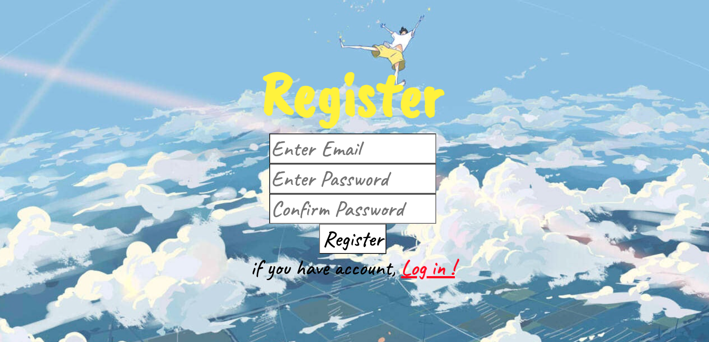
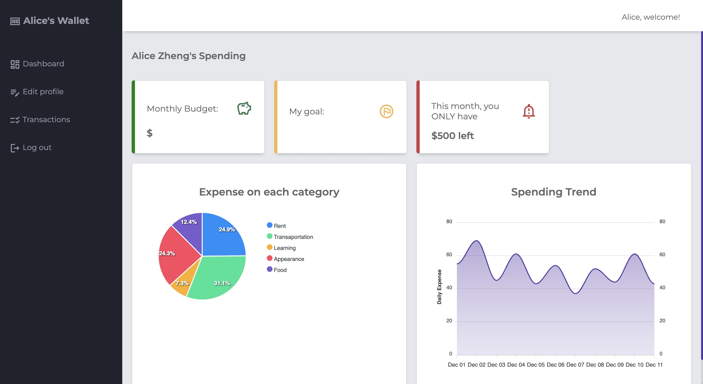

# Wallet

A web application for keeping track of daily expenses, and virtualizing the transaction datas to creat a healthy habit of consumption. 

Built with node.js, Express.js and HTML5 and some other libraries to add more functionalities and practicality. 
- Express-validator: to verify data type and value before inserting mongodb
- Bcryptjs: to encrypt user's password and other private data
- jsonwebtoken: for user authentication

## Wanna a try?
1. npm install (in terminal) to download all necessary library
2. get mongodb url (recommend mongodb Atlas)
3. npm start (in terminal) to start backend
4. use Chrome or other browser to show frontend pages

## Some screenshots
1. Page for registering

2. Page for dashboard

# Other resource
1. Design Document
https://docs.google.com/document/d/1RWQS7tNZomqxGp7Qe9gcmmVnadSVdxNLjlC5dCsnh5U/edit?usp=sharing

2. Youtube Video
https://youtu.be/Lntm8aa38KQ

3. Google Slide
https://docs.google.com/presentation/d/1f0qcLbI5bNLf0m7c5FcMWldd6m-4J8LSj9eHIxceSK4/edit?usp=sharing

Created by Lingyi Zheng, Hui Hu
